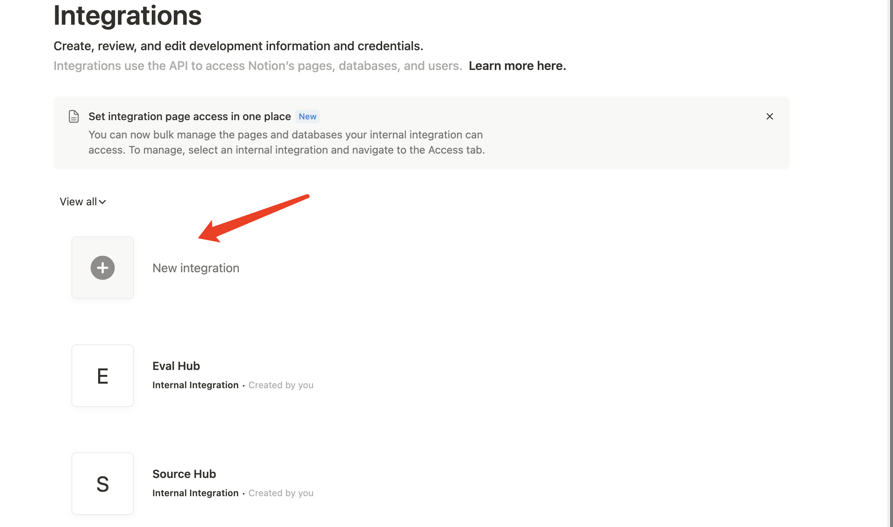
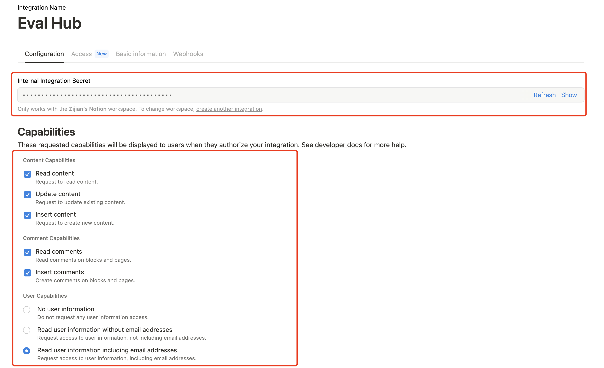
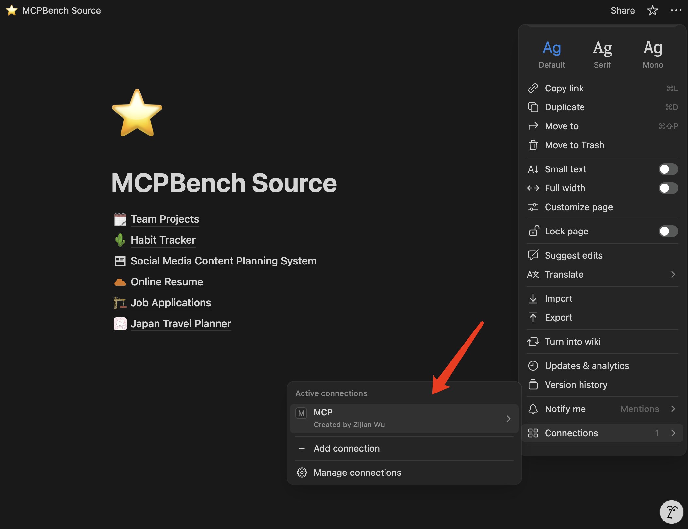

# MCPBench

MCPBench is a comprehensive evaluation suite for testing AI models’ ability to operate a Notion workspace through the **Model Context Protocol (MCP)**.  
It ships with **20 real-world tasks** (e.g., habit tracker, online resume builder) that can be run against **your own MCP server and your own Notion pages**.

---

## 1 · Set-up Your Notion Workspace

1. **Duplicate the MCPBench Source Pages**  
   Copy the template database and pages into your workspace from the public template:  
   [Duplicate MCPBench Source](https://early-rest-d97.notion.site/MCPBench-Source-22c0b91d1c3f80bb8c28d142062abe50).

2. **Create a Notion Integration & Grant Access**  
   a. Go to [Notion Integrations](https://www.notion.so/profile/integrations) and create a new internal integration.  
   b. Copy the generated **Internal Integration Token** (this will be your `NOTION_API_KEY`).  
   c. Share the **root “MCPBench” page** with the new integration (*Full Access*).
   
   
   
   

---

## 2 · Environment Variables

```bash
# Mandatory
export NOTION_API_KEY="your_notion_key"        # From step 2b above
export MCPBENCH_BASE_URL="https://your-mcp-server"
export MCPBENCH_API_KEY="your_model_api_key"   # Auth token for your MCP server
export MCPBENCH_MODEL_NAME="your_model_name"   # e.g. gpt-4o

# Optional (for verbose tracing through OpenAI endpoints)
export OPENAI_API_KEY="your_openai_key"
```

For running task verification scripts directly (e.g., `python tasks/habit_tracker/task_1/verify.py`) or the test suite, make sure the repository root is on your Python module search path:

```bash
export PYTHONPATH="$(pwd):${PYTHONPATH}"
```

---

## 3 · Installation

```bash
pip install -r requirements.txt
```

---

## 4 · Authenticate with Notion

```bash
# Choose browser engine: firefox | chromium
python src/notion_login.py --headless --browser firefox
# Verify login succeeded
python tests/test_login.py
```

---

## 5 · Run the Evaluation

```bash
# Evaluate ALL 20 tasks
python src/pipeline.py --tasks all --model-name $MCPBENCH_MODEL_NAME

# Evaluate a single task group
python src/pipeline.py --tasks online_resume --model-name $MCPBENCH_MODEL_NAME

# Evaluate one specific task
python src/pipeline.py --tasks online_resume/task_1 --model-name $MCPBENCH_MODEL_NAME
```

Results are written to `./results/` (JSON + CSV).  
Open the generated CSV in any spreadsheet tool for a quick overview.

---

## 6 · Project Structure

```
MCPBench/
├── src/
│   ├── pipeline.py            # Main evaluation entry point
│   ├── notion_login.py        # Browser-based login utility
│   └── core/                  # Task runner, results reporter, template mgr.
├── tasks/                     # 20 evaluation tasks across 6 categories
├── tests/                     # Full pytest suite
├── docs/                      # Additional guides & screenshots
└── results/                   # Auto-generated evaluation outputs
```

---

## 7 · Contributing

1. Fork the repository and create a feature branch.  
2. Add new tasks inside `tasks/<category>/<task_n>/` with a `description.md` and a `verify.py`.  
3. Ensure all tests pass.  
4. Submit a pull request — contributions are welcome!

---

Happy benchmarking! 🎉