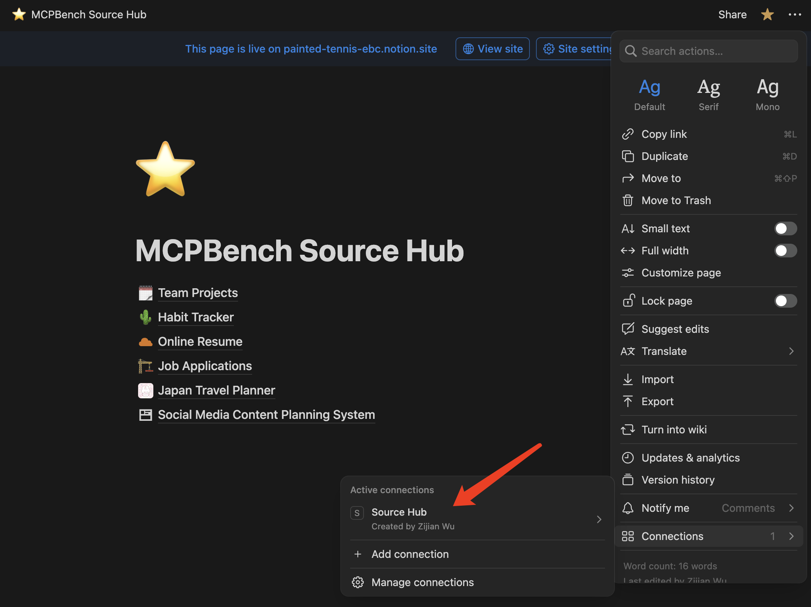

# MCPBench

MCPBench is a comprehensive evaluation suite for testing AI models’ ability to operate a Notion workspace through the **Model Context Protocol (MCP)**.  
It ships with **20 real-world tasks** (e.g., habit tracker, online resume builder) that can be run against **your own MCP server and your own Notion pages**.

---

## 1 · Set-up Your Notion Workspace

1. **Duplicate the MCPBench Source Pages**  
   Copy the template database and pages into your workspace from the public template:  
   [Duplicate MCPBench Source](https://painted-tennis-ebc.notion.site/MCPBench-Source-Hub-23181626b6d7805fb3a7d59c63033819).

2. **Set Up Source Hub and Eval Hub for Environment Isolation**
   - You will need **two separate Notion workspaces (or root pages)**:
     - **Source Hub**: Stores all the template databases/pages. Managed by `SOURCE_NOTION_API_KEY`.
     - **Eval Hub**: Only contains the duplicated templates for the current evaluation. Managed by `EVAL_NOTION_API_KEY`.
   - In Notion, create an **empty page** in your Eval Hub. The page name **must exactly match** the value you set for `EVAL_PARENT_PAGE_TITLE` in your environment variables (e.g., `MCPBench Eval Hub`).
   - In Notion's **Connections** settings:
     - Bind the integration corresponding to `EVAL_NOTION_API_KEY` to the Eval Hub parent page you just created.
     - Bind the integration corresponding to `SOURCE_NOTION_API_KEY` to your Source Hub (where the templates are stored).

3. **Create Notion Integrations & Grant Access**  
   a. Go to [Notion Integrations](https://www.notion.so/profile/integrations) and create two internal integrations (one for Source Hub, one for Eval Hub).  
   b. Copy the generated **Internal Integration Tokens** (these will be your `SOURCE_NOTION_API_KEY` and `EVAL_NOTION_API_KEY`).  
   c. Share the **Source Hub** with the Source integration, and the **Eval Hub parent page** with the Eval integration (*Full Access*).
   
   
   
   
   

---

## 2 · Environment Variables

All environment variables **must** be set in a file named `.mcp_env` in your project root. Example:

```env
# For OpenAI API tracing (optional)
OPENAI_TRACE_API_KEY="sk-proj-xxx-xxx-xx"

# Service Credentials
## Notion
SOURCE_NOTION_API_KEY="your-source-notion-api-key"   # For Source Hub (templates)
EVAL_NOTION_API_KEY="your-eval-notion-api-key"       # For Eval Hub (active evaluation)
EVAL_PARENT_PAGE_TITLE="MCPBench Eval Hub"           # Must match the name of the empty page you created in Eval Hub

## GitHub
GITHUB_TOKEN="your-github-token-here"

## Postgres
POSTGRES_PASSWORD="your-postgres-password"
POSTGRES_HOST="localhost"
POSTGRES_PORT="5432"
POSTGRES_DATABASE="your-database-name"
POSTGRES_USERNAME="your-postgres-username"

# Model Providers (set only those you need)
## Google Gemini
GEMINI_BASE_URL="https://your-gemini-base-url.com/v1"
GEMINI_API_KEY="your-gemini-api-key"

## DeepSeek
DEEPSEEK_BASE_URL="https://your-deepseek-base-url.com/v1"
DEEPSEEK_API_KEY="your-deepseek-api-key"

## OpenAI
OPENAI_BASE_URL="https://your-openai-base-url.com/v1"
OPENAI_API_KEY="your-openai-api-key"

## Anthropic
ANTHROPIC_BASE_URL="https://your-anthropic-base-url.com/v1"
ANTHROPIC_API_KEY="your-anthropic-api-key"

## Moonshot
MOONSHOT_BASE_URL="https://your-moonshot-base-url.com/v1"
MOONSHOT_API_KEY="your-moonshot-api-key"

## xAI
XAI_BASE_URL="https://your-xai-base-url.com/v1"
XAI_API_KEY="your-xai-api-key"
```

You only need to set the variables for the model providers you plan to use. Currently supported model providers: **OpenAI, Google Gemini, DeepSeek, Anthropic, Moonshot, xAI**.

For running task verification scripts directly (e.g., `python tasks/habit_tracker/task_1/verify.py`) or the test suite, make sure the repository root is on your Python module search path:

```bash
export PYTHONPATH="$(pwd):${PYTHONPATH}"
```

---

## 3 · Installation

```bash
pip install -r requirements.txt
```

---

## 4 · Authenticate with Notion

```bash
# First, run the Notion login helper with your preferred browser
python src/mcp_services/notion/notion_login_helper.py --browser {firefox|chromium}

# If login is successful, a cookie file `notion_state.json` will be generated in the project root
# Verify the login was successful
python tests/test_login.py
```

The verification script will tell you which browser is working properly. The pipeline defaults to using **chromium**. Our pipeline has been **fully tested on macOS and Linux**.

---

## 5 · Run the Evaluation

```bash
# Evaluate ALL 20 tasks
python pipeline.py --tasks all --model-name $MCPBENCH_MODEL_NAME

# Evaluate a single task group
python pipeline.py --tasks online_resume --model-name $MCPBENCH_MODEL_NAME

# Evaluate one specific task
python pipeline.py --tasks online_resume/task_1 --model-name $MCPBENCH_MODEL_NAME
```

**Auto-resume is supported:** When you rerun an evaluation command, only unfinished tasks will be executed. Tasks that previously failed due to pipeline errors (such as `State Duplication Error` or `MCP Network Error`) will also be retried automatically.

Results are written to `./results/` (JSON + CSV).  

---

## 6 · Project Structure

```
MCPBench/
├── src/
│   ├── pipeline.py            # Main evaluation entry point
│   ├── notion_login.py        # Browser-based login utility
│   └── core/                  # Task runner, results reporter, template mgr.
├── tasks/                     # 20 evaluation tasks across 6 categories
├── tests/                     # Full pytest suite
├── docs/                      # Additional guides & screenshots
└── results/                   # Auto-generated evaluation outputs
```

---

## 7 · Contributing

1. Fork the repository and create a feature branch.  
2. Add new tasks inside `tasks/<category>/<task_n>/` with a `description.md` and a `verify.py`.  
3. Ensure all tests pass.  
4. Submit a pull request — contributions are welcome!

---

Happy benchmarking! 🎉