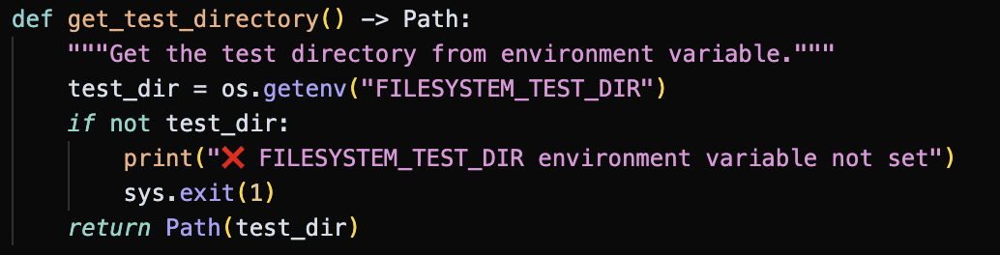
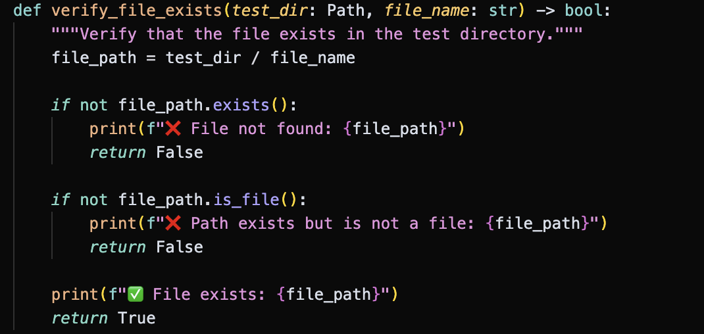
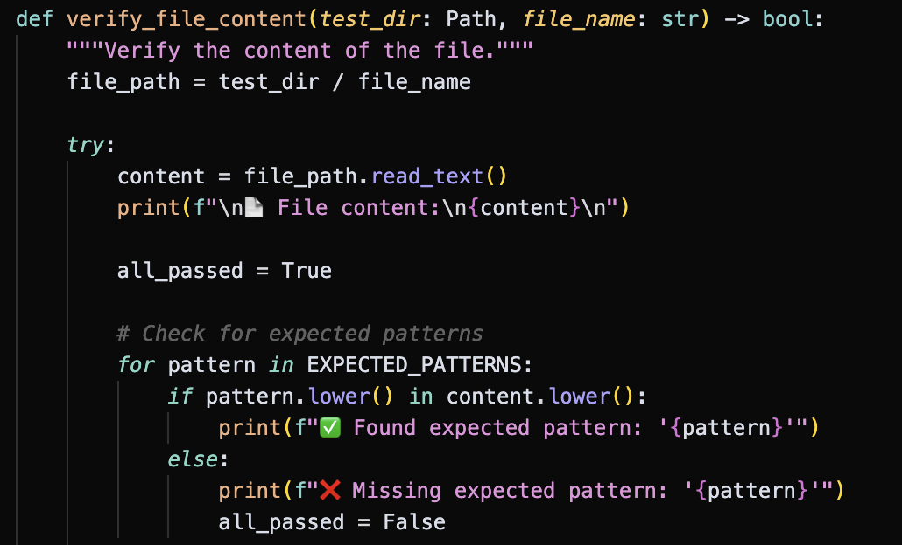

# Task

The tasks in MCPMark follows two major principles
- The tasks are based on realistic digital environments that are also used by human programmers.
- The task outcome can be robustly verified in python scripts.

Therefore, each MCPMark task consists of two files

- `description.md`
- `verify.py`

Here, `description.md` describes the purpose and setting of the task, as well as the instruction to complete the task. `verify.py` checks whether the task is completed successfully.

For example, you can ask the model agent to create a file with specific name and write specific content to the file. The structure looks like

```
tasks 
│
└───filesystem
   │
   └───create_file_write
       │   description.md
       │   verify.py
```

Note that all tasks are placed under `tasks/`. `filesystem` refers to the environment for the MCP service.

`description.md` could include the following information

- Task name
    - Create and Write File.
- Task description
    - Use the filesystem MCP tools to create a new file and write content to it.
- Task Objectives
    - Create a new file named `hello_world.txt` in the test directory.
    - Write the following content to the file:   ```   Hello, World```
    - Verify the file was created successfully
-  Verification Criteria
    - File `hello_world.txt` exists in the test directory
    - File contains the expected content structure
    - File includes "Hello, World!" on the first line
- Tips
    - Use the `write_file` tool to create and write content to the file
    - The test directory path will be provided in the task context

The entire content of `description.md` will be read by the model agent for completing the task. 

Accordingly, the `verify.py` contains the following functionalities
- Check whether the target directory exists. 
- Check whether the target directory contains the file with target file name. 
- Check whether the target file contains the desired content `EXPECTED_PATTERNS = ["Hello Wolrd"]`. 
- If the outcome passes **all the above verification functionalities**, the task would be marked as successfully completed.