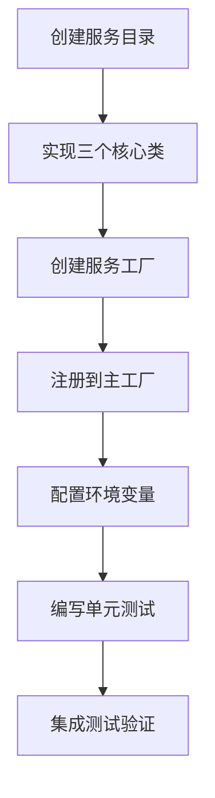

# MCPBench 基础设施文档

## 📚 文档导航

本目录包含了 MCPBench 项目的完整基础设施架构分析和实现指南。通过这些文档，您可以深入了解项目架构、学习参考实现，并获得新服务集成的详细指导。

### 🏗️ 架构概述
- **[总体架构分析](./mcp-service-architecture.md)**: 完整的系统架构设计原则、设计模式和扩展指南

### 📖 参考实现 
- **[Notion MCP Server 分析](./notion-mcp-analysis.md)**: 深度解析 Notion 实现，作为其他服务的参考模板

### 🛠️ 实现指南
- **[GitHub & PostgreSQL 实现指南](./github-postgres-implementation-guide.md)**: 详细的代码框架和实施步骤

### 🔧 开发参考
- **[基础组件接口参考](./base-components-reference.md)**: 抽象基类规范、最佳实践和集成检查清单

---

## 🎯 快速开始

### 对于架构理解
1. 首先阅读 **[总体架构分析](./mcp-service-architecture.md)** 了解整体设计
2. 然后查看 **[Notion 实现分析](./notion-mcp-analysis.md)** 学习具体实现模式

### 对于新服务开发
1. 参考 **[实现指南](./github-postgres-implementation-guide.md)** 获取代码框架
2. 对照 **[基础组件参考](./base-components-reference.md)** 确保符合接口规范
3. 使用集成检查清单验证实现完整性

---

## 📈 架构亮点

MCPBench 采用了现代化的软件架构设计：

```
┌─────────────────────────────────────────────────────────────┐
│                    MCPBench 分层架构                       │
│                                                             │
│  🏭 Factory Pattern     📊 Config Management               │
│  ┌─────────────────────────────────────────────────────────┐│
│  │              抽象基类层 (Abstract Layer)                ││
│  │  TaskManager  │  StateManager  │  LoginHelper          ││
│  └─────────────────────────────────────────────────────────┘│
│  ┌─────────────────────────────────────────────────────────┐│
│  │               服务实现层 (Service Layer)                ││
│  │   Notion      │    GitHub     │   PostgreSQL           ││
│  └─────────────────────────────────────────────────────────┘│
│  ┌─────────────────────────────────────────────────────────┐│
│  │               MCP 集成层 (MCP Layer)                    ││
│  │   MCP Servers │  Tool Calls   │   Async Execution      ││
│  └─────────────────────────────────────────────────────────┘│
└─────────────────────────────────────────────────────────────┘
```

### 核心优势

- ✅ **高度模块化**: 清晰的职责分离和接口定义
- ✅ **易于扩展**: 标准化的实现模式和工厂注册
- ✅ **配置驱动**: 统一的环境变量管理
- ✅ **异步优化**: 高性能的并发任务执行
- ✅ **错误隔离**: 服务间故障不互相影响

---

## 🔍 技术特性

### MCP 服务器集成
- **统一接口**: 通过 `MCPServerStdio` 统一集成不同 MCP 服务器
- **环境隔离**: 每个服务独立的环境变量和配置空间
- **连接优化**: 工具缓存和连接复用机制

### 状态管理
- **任务隔离**: 每个任务独立的执行环境
- **资源清理**: 自动化的资源生命周期管理
- **错误恢复**: 健壮的错误处理和重试机制

### 认证系统
- **多样化认证**: 支持 Token、OAuth、数据库连接等多种认证方式
- **状态持久化**: 安全的认证状态存储和复用
- **权限验证**: 细粒度的权限检查和验证

---

## 🚀 扩展路径

### 添加新 MCP 服务的标准流程



1. **📁 目录结构**: `src/mcp_services/{service_name}/`
2. **🔧 核心组件**: TaskManager + StateManager + LoginHelper
3. **🏭 工厂注册**: 在主工厂中注册新服务
4. **⚙️ 配置管理**: 添加环境变量配置
5. **✅ 测试验证**: 完整的单元和集成测试

### 支持的 MCP 服务类型

- **🌐 Web 服务**: 如 Notion、GitHub、GitLab 等
- **🗄️ 数据库**: 如 PostgreSQL、MySQL、MongoDB 等  
- **☁️ 云平台**: 如 AWS、Azure、GCP 服务
- **🔧 开发工具**: 如 Jira、Confluence、Slack 等

---

## 🎓 学习路径

### 初级 - 理解架构
1. **架构概述**: 了解整体设计思路
2. **设计模式**: 学习工厂模式和策略模式的应用
3. **接口规范**: 掌握抽象基类的定义和作用

### 中级 - 分析实现
1. **Notion 深度分析**: 理解完整实现的各个细节
2. **MCP 集成**: 学习如何集成和配置 MCP 服务器
3. **状态管理**: 掌握资源生命周期管理

### 高级 - 开发实践
1. **服务实现**: 按照指南实现新的 MCP 服务
2. **性能优化**: 异步执行、连接复用等优化技巧
3. **测试策略**: 完整的测试覆盖和质量保证

---

## 🤝 贡献指南

### 文档改进
- 发现错误或不清晰的地方，欢迎提 Issue
- 补充实际使用经验和最佳实践
- 提供新的使用案例和示例

### 架构扩展
- 提出新的设计模式建议
- 优化现有组件接口
- 增加新的功能特性

### 实现贡献
- 实现新的 MCP 服务集成
- 优化现有服务的性能
- 增加错误处理和边界案例

---

## 📞 获取帮助

- **架构问题**: 参考 [总体架构分析](./mcp-service-architecture.md)
- **实现细节**: 查看 [Notion 实现分析](./notion-mcp-analysis.md)
- **开发指导**: 使用 [实现指南](./github-postgres-implementation-guide.md)
- **接口规范**: 对照 [基础组件参考](./base-components-reference.md)

通过这些文档，您应该能够全面理解 MCPBench 的架构设计，并成功实现新的 MCP 服务集成。 