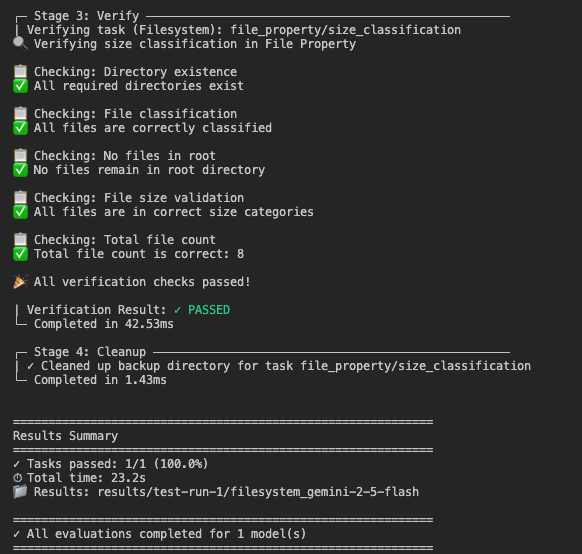

# Quick Start
To quickly experience MCPMark, we recommend firstly preparing the environment, and then execute the Postgres tasks.

### 1. Clone MCPMark
```bash
git clone https://github.com/eval-sys/mcpmark.git

cd mcpmark
```

### 2. Setup Environment Variables
To setup the model access in environment variable, edit the `.mcp_env` file in `mcpmark/`.

```env
# Model Providers (set only those you need)
## Google Gemini
GEMINI_BASE_URL="https://your-gemini-base-url.com/v1"
GEMINI_API_KEY="your-gemini-api-key"

## DeepSeek
DEEPSEEK_BASE_URL="https://your-deepseek-base-url.com/v1"
DEEPSEEK_API_KEY="your-deepseek-api-key"

## OpenAI
OPENAI_BASE_URL="https://your-openai-base-url.com/v1"
OPENAI_API_KEY="your-openai-api-key"

## Anthropic
ANTHROPIC_BASE_URL="https://your-anthropic-base-url.com/v1"
ANTHROPIC_API_KEY="your-anthropic-api-key"

## Moonshot
MOONSHOT_BASE_URL="https://your-moonshot-base-url.com/v1"
MOONSHOT_API_KEY="your-moonshot-api-key"

## xAI
XAI_BASE_URL="https://your-xai-base-url.com/v1"
XAI_API_KEY="your-xai-api-key"
```

### 3. Run Quick Example in MCPMark
Suppose you are running the employee query task with gemini-2.5-flash, and name your experiment as test-run-1, you can use the following command to test the `size_classification` task in `file_property`, which categorizes files by their sizes.

```bash
python -m pipeline 
--exp-name test-run-1
--mcp filesystem
--tasks file_property/size_classification
--models gemini-2.5-flash
```

Here is the expected output (the verification may encounter failure due to model choices). 


The reuslts are saved under `restuls/{exp_name}/{mcp}_{model}/{tasks}`, if `exp-name` is not specified, the default name would be timestamp of the experiment (but specifying the `exp-name` is useful for resuming experiments).

For other MCP services, please refers to the [Installation and Docker Usage Page](./installation_and_docker_usage.md) for detailed instruction. 


