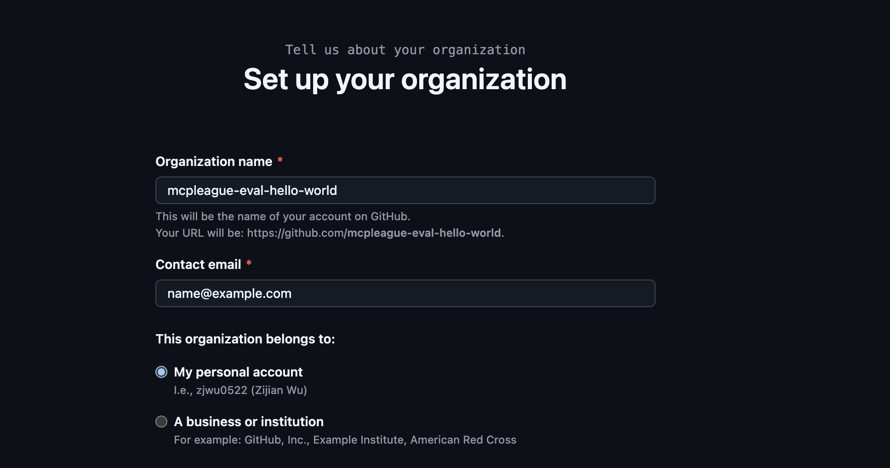
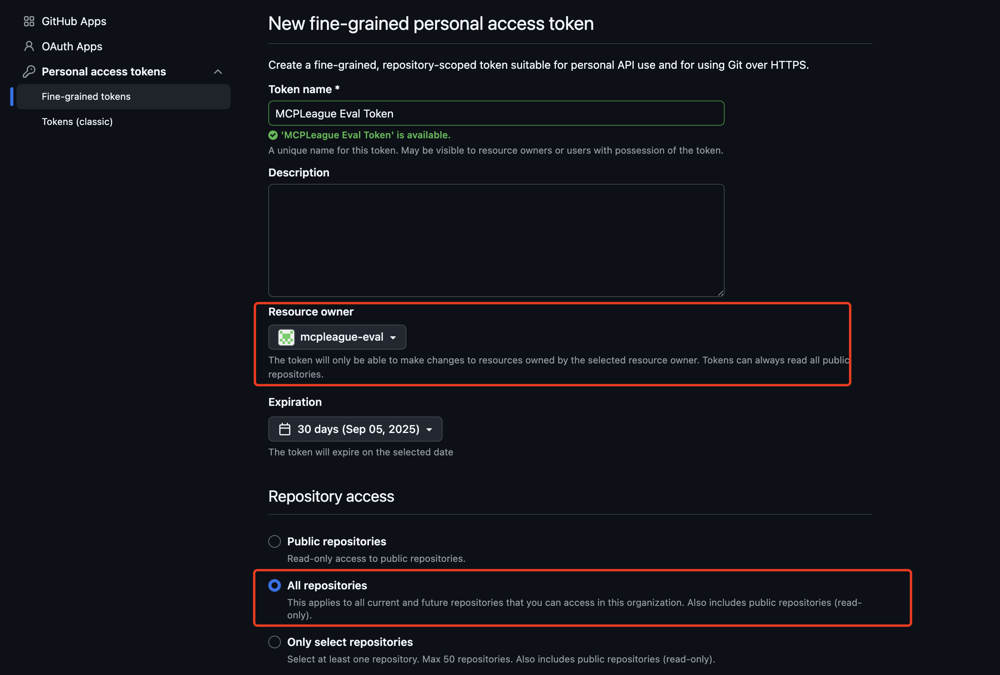
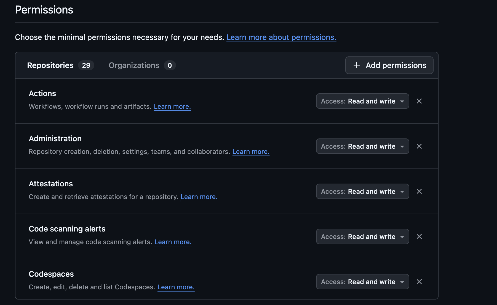

# GitHub Environment Preparation

This guide walks you through preparing your GitHub environment for MCPLeague and authenticating the CLI tools.

## 1 · Prepare Your Evaluation Organization

1. **Create a free github Organization**  
   - In GitHub, click your avatar → **Your organizations** → **New organization**.  
   - We recommend a name like `mcpleague-eval-xxx`. (Check if there is a conflict with other organization names.)
   - This keeps all benchmark repositories isolated from your personal and work code.  
   - 

2. **Generate a Fine-Grained Personal Access Token (PAT) with Full Access**  
   - Navigate to *Settings → Developer settings → Personal access tokens → Fine-grained tokens*.  
   - Click **Generate new token**, select the organization you just created, and give the token a descriptive name (e.g., *MCPLeague Eval Token*).  
   - Under **Repository permissions** and **Organization permissions**, enable **All permissions**.  
   - Copy the generated token — this will be your `GITHUB_TOKEN`.  
   -   
   - 

3. **Add Credentials to `.mcp_env`**  
   In your project root, edit (or create) the `.mcp_env` file and add:
   ```env
   ## GitHub
   GITHUB_TOKEN="ghp_your-token-here"
   GITHUB_EVAL_ORG="mcp-eval"
   ```

---

## 2 · Download the Sample Repository State

We have pre-exported several popular open-source repositories along with curated Issues and PRs.

1. Download the archive from [Google Drive](https://drive.google.com/your-link-here).  
2. Extract it so that the directory `./github_state/` appears in the project root:
   ```bash
   mkdir -p github_state
   unzip mcpleague_github_state.zip -d ./github_state
   ```

---

## 3 · Add New Repositories (Optional)

If you want to benchmark additional repositories:

1. Export the desired repository state:
   ```bash
   python -m src.mcp_services.github.repo_exporter --repo owner/name --out ./github_state/{your_repo_name}
   ```
2. Open `src/mcp_services/github/state_manager.py` and add a new entry to `self.initial_state_mapping` pointing to the exported folder.

---

## 4 · GitHub Rate Limits

Fine-grained tokens are subject to GitHub write-rate limits: **80 writes per minute** and **500 writes per hour**. Consequently, MCPLeague caps each repository at **≤ 20 Issues** and **≤ 10 PRs** by default. 