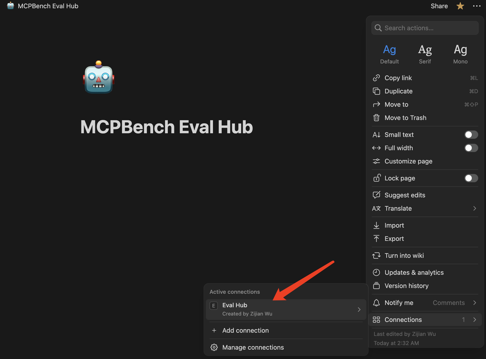

# Notion Env Setup & Authentication

This guide walks you through preparing your Notion environment for MCPMark and authenticating the CLI tools.

## 1 · Set-up Your Notion Env

1. **Duplicate the MCPMark Source Pages**
   Copy the template database and pages into your workspace from the public template:
   [Duplicate MCPMark Source](https://painted-tennis-ebc.notion.site/MCPBench-Source-Hub-23181626b6d7805fb3a7d59c63033819).

2. **Set Up Source Hub and Eval Hub for Environment Isolation**
   - You will need **two separate Notion pages**:
     - **Source Hub**: Stores all the template databases/pages. Managed by `SOURCE_NOTION_API_KEY`.
     - **Eval Hub**: Only contains the duplicated templates for the current evaluation. Managed by `EVAL_NOTION_API_KEY`.
   - In Notion, create an **empty page** in your Eval Hub. The page name **must exactly match** the value you set for `EVAL_PARENT_PAGE_TITLE` in your environment variables (e.g., `MCPMark Eval Hub`).
   - In Notion's **Connections** settings:
     - Bind the integration corresponding to `EVAL_NOTION_API_KEY` to the Eval Hub parent page you just created.
     - Bind the integration corresponding to `SOURCE_NOTION_API_KEY` to your Source Hub (where the templates are stored).

3. **Create Notion Integrations & Grant Access**
   a. Go to [Notion Integrations](https://www.notion.so/profile/integrations) and create **two internal integrations** (one for Source Hub, one for Eval Hub).
   b. Copy the generated **Internal Integration Tokens** (these will be your `SOURCE_NOTION_API_KEY` and `EVAL_NOTION_API_KEY`).
   c. Share the **Source Hub** with the Source integration, and the **Eval Hub parent page** with the Eval integration (*Full Access*).
   
   
   
   
   

---

## 2 · Authenticate with Notion

```bash
# First, install Playwright and the browser binaries
playwright install
# Then, run the Notion login helper with your preferred browser
python -m src.mcp_services.notion.notion_login_helper --browser {firefox|chromium}

# If login is successful, a cookie file `notion_state.json` will be generated in the project root
# Verify the login was successful
python -m tests.test_login
```

The verification script will tell you which browser is working properly. The pipeline defaults to using **chromium**. Our pipeline has been **fully tested on macOS and Linux**.
